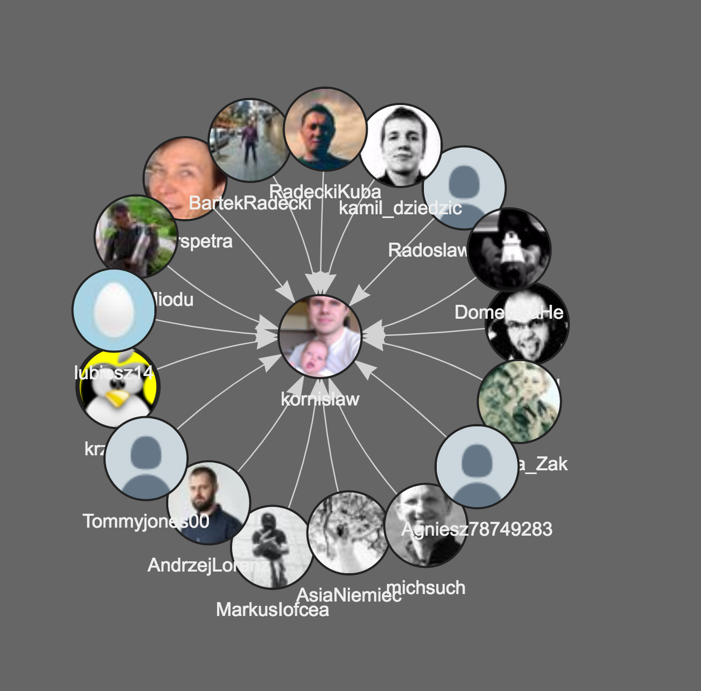

The goal of the project is to analyze a predefined list of Twitter users in order to highlight thought leaders (the ones who are followed by the others most).

## Roadmap

* v0.1 - initial commit, loading example relations (user+followers), sample visualisation
* v0.2 - user+followers+following, discovering relations between followers and following; visualiztaion
* v0.3 - collecting followers for a predefined list of though leaders; storing data in a local sqlite db
* v0.4 - new thought leaders discovery
* v0.5 - web interface for managing predefined lists

## Backlog

* other metrics, i.e. retweets, likes, @mentions
* user accounts

## Change log

* v0.1 done,
  * example - followers of my petty account:

